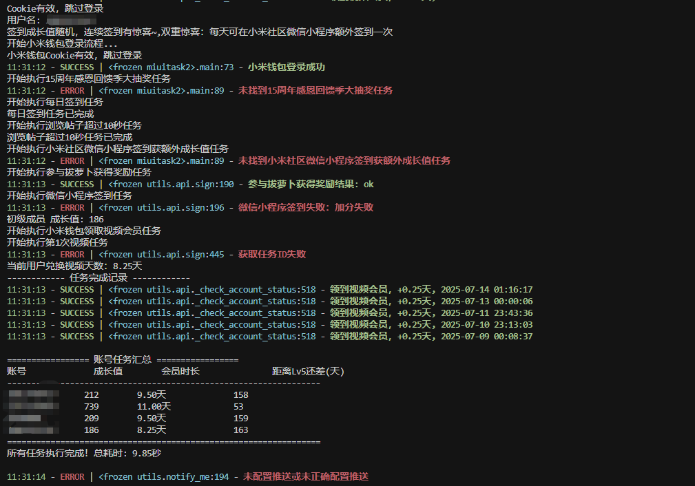

# MIUI 自动签到工具

一个功能强大的小米社区以及小米钱包自动签到工具，支持多账号管理、自动验证码识别、微信推送通知等功能。

### 🖼️ 运行截图



## 📞 支持
**获取源码/远程/合作/定制开发请联系：**
- 微信：james_hui666
- 公众号：James吖

## ✨ 主要功能
### 🔐 小米社区签到
- **每日签到** - 自动完成小米社区每日签到
- **浏览任务** - 自动浏览用户页面、帖子、视频帖子
- **点赞任务** - 自动点赞内容
- **关注任务** - 自动关注版块
- **特殊页面浏览** - 自动浏览特殊页面
- **微信签到** - 支持微信小程序签到
- **胡萝卜拉取** - 自动完成胡萝卜相关任务
- **成长值统计** - 显示账号成长值和距离Lv5所需天数

### 💰 小米钱包视频会员
- **自动领取视频会员** - 每日自动领取小米钱包视频会员福利
- **会员时长查询** - 实时查询当前会员时长

### 🤖 智能功能
- **自动验证码识别** - 集成2captcha服务，自动处理验证码
- **扫码登录** - 支持扫码登录小米账号自动保存账号数据
- **多账号支持** - 支持同时管理多个小米账号
- **微信推送通知** - 任务完成后自动推送结果到微信
- **详细日志记录** - 完整的任务执行日志和错误记录
- **任务汇总报告** - 生成账号任务执行汇总表格

## 📋 系统要求

- Windows/Linux/macOS（支持宝塔、青龙等自动任务）

### 推送配置

onepush支持多种推送方式：
- 微信推送
- 钉钉推送
- 企业微信推送
- 邮件推送
- 等等...

## 📊 功能特性

### 自动签到任务
- ✅ 每日签到
- ✅ 浏览用户页面
- ✅ 浏览帖子
- ✅ 浏览视频帖子
- ✅ 点赞内容
- ✅ 浏览特殊页面
- ✅ 关注版块
- ✅ 胡萝卜拉取
- ✅ 微信签到

### 小米钱包功能
- ✅ 自动领取视频会员
- ✅ 会员时长查询
- ✅ 成长值统计

### 智能功能
- ✅ 自动验证码识别
- ✅ 多账号并发处理
- ✅ 失败重试机制
- ✅ 详细日志记录
- ✅ 任务执行汇总

## 📈 输出示例

程序运行后会显示类似以下的汇总信息：

```
================= 账号任务汇总 =================
账号             成长值      会员时长              距离Lv5还差(天)    
-------------------------------------------------
3081749457      850        15.20天              30
2357335843      920        12.50天              16
4799886         780        18.30天              44
3082923365      890        14.80天              22
=================================================
所有任务执行完成！总耗时: 45.23秒
```

## 🔍 日志文件

程序会在 `logs/` 文件夹中生成详细的日志文件：
- 文件名格式：`日志文件.YYYY-MM-DD_HH-MM-SS_XXXXXX.log`
- 包含所有任务的执行详情
- 错误信息和调试信息
- 保留最近10天的日志

## ⚠️ 注意事项

1. **Cookie有效期**：Cookie通常有有效期，需要定期更新
2. **账号安全**：请妥善保管账号信息，不要泄露给他人
3. **使用频率**：建议每日运行一次，避免过于频繁的请求
4. **网络环境**：确保网络连接稳定，避免任务执行失败
5. **验证码服务**：如需使用验证码识别，请确保2captcha服务正常

## 🛠️ 故障排除

### 常见问题

1. **Cookie失效**
   - 重新获取Cookie并更新配置
   - 检查Cookie格式是否正确

2. **任务执行失败**
   - 检查网络连接
   - 查看日志文件中的错误信息
   - 确认账号状态正常

3. **推送通知失败**
   - 检查推送配置是否正确
   - 确认推送服务可用

4. **验证码识别失败**
   - 检查2captcha API密钥
   - 确认账户余额充足

## 📄 许可证

本项目仅供学习和个人使用，请遵守相关平台的使用条款。

## 📞 支持

**获取源码/远程/合作/定制开发请联系：**
- 微信：james_hui666
- 公众号：James吖

---

**免责声明**：本工具仅供学习和个人使用，使用者需自行承担使用风险，开发者不承担任何责任。 
